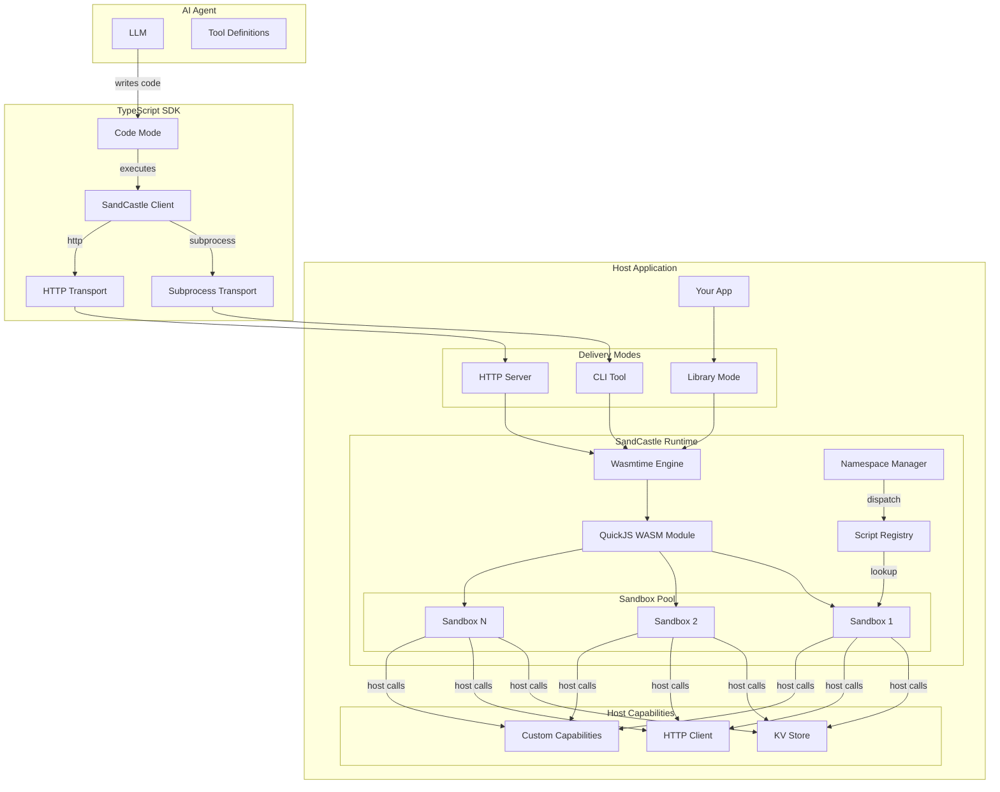
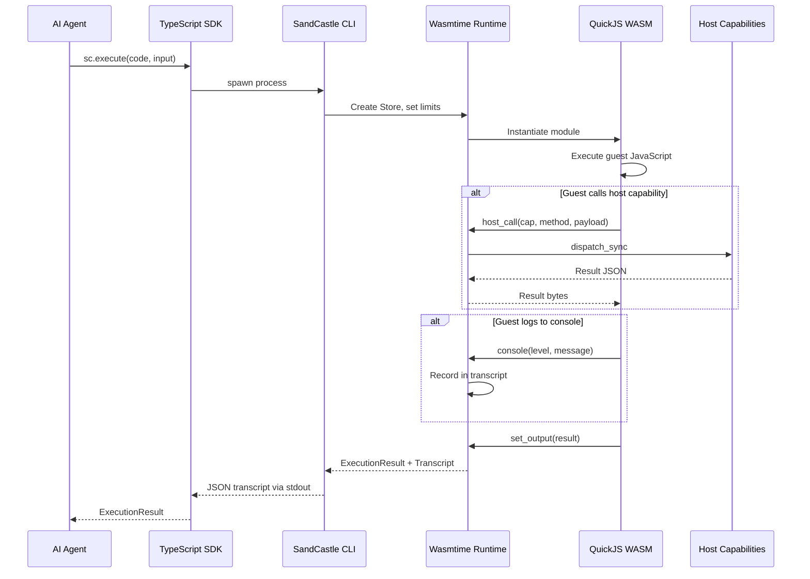
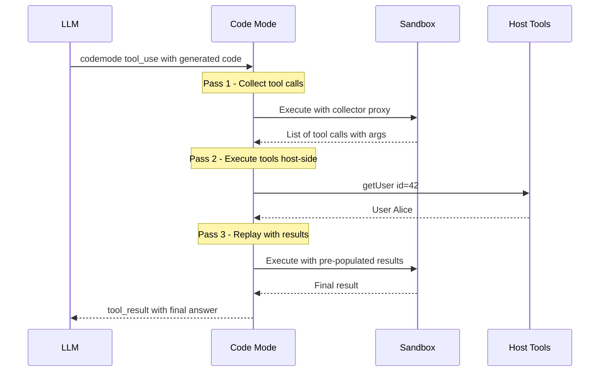
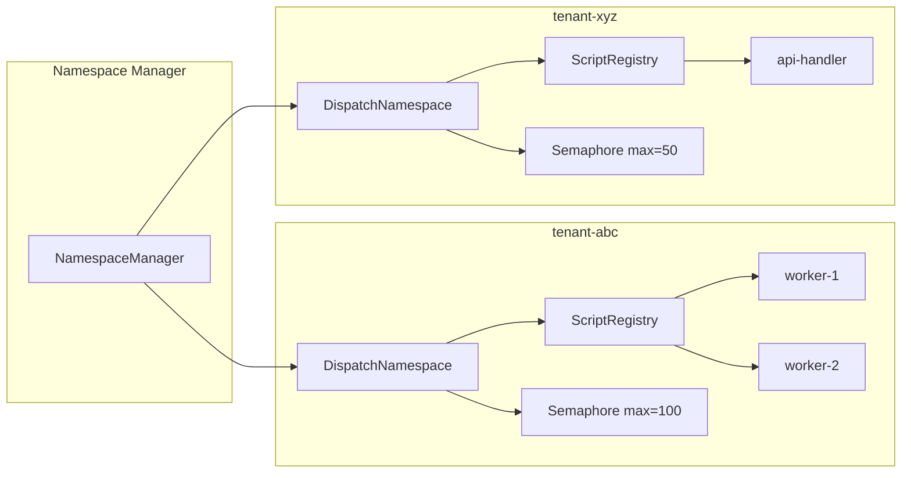
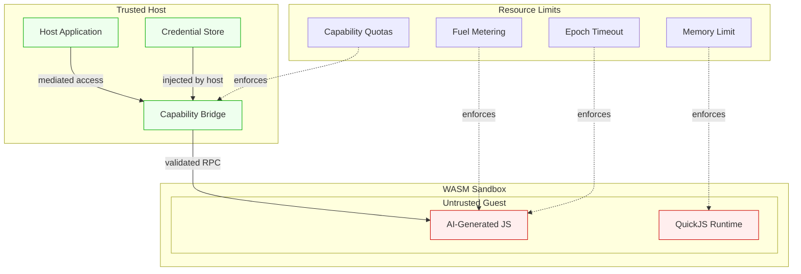

# SandCastle Architecture

## High-Level Overview

```mermaid
graph TB
    subgraph Host Application
        APP[Your App]

        subgraph SandCastle Runtime
            ENGINE[Wasmtime Engine]
            MODULE[QuickJS WASM Module]

            subgraph Sandbox Pool
                S1[Sandbox 1]
                S2[Sandbox 2]
                S3[Sandbox N]
            end

            REG[Script Registry]
            NS[Namespace Manager]
        end

        subgraph Host Capabilities
            KV[KV Store]
            HTTP[HTTP Client]
            CUSTOM[Custom Capabilities]
        end

        subgraph Delivery Modes
            LIB[Library Mode]
            CLI[CLI Tool]
            SERVE[HTTP Server]
        end
    end

    subgraph TypeScript SDK
        CLIENT[SandCastle Client]
        CODEMODE[Code Mode]
        TRANSPORT_SUB[Subprocess Transport]
        TRANSPORT_HTTP[HTTP Transport]
    end

    subgraph AI Agent
        LLM[LLM]
        TOOLS[Tool Definitions]
    end

    LLM -->|writes code| CODEMODE
    CODEMODE -->|executes| CLIENT
    CLIENT -->|subprocess| TRANSPORT_SUB --> CLI
    CLIENT -->|http| TRANSPORT_HTTP --> SERVE

    APP --> LIB
    LIB --> ENGINE
    CLI --> ENGINE
    SERVE --> ENGINE

    ENGINE --> MODULE
    MODULE --> S1 & S2 & S3

    S1 & S2 & S3 -->|host calls| KV & HTTP & CUSTOM

    REG -->|lookup| S1
    NS -->|dispatch| REG
```

## Sandbox Execution Flow

```mermaid
sequenceDiagram
    participant Agent as AI Agent
    participant SDK as TypeScript SDK
    participant CLI as SandCastle CLI
    participant RT as Wasmtime Runtime
    participant QJS as QuickJS WASM
    participant CAP as Host Capabilities

    Agent->>SDK: sc.execute(code, input)
    SDK->>CLI: spawn process
    CLI->>RT: Create Store, set limits
    RT->>QJS: Instantiate module
    QJS->>QJS: Execute guest JavaScript

    alt Guest calls host capability
        QJS->>RT: host_call(cap, method, payload)
        RT->>CAP: dispatch_sync
        CAP-->>RT: Result JSON
        RT-->>QJS: Result bytes
    end

    alt Guest logs to console
        QJS->>RT: console(level, message)
        RT->>RT: Record in transcript
    end

    QJS->>RT: set_output(result)
    RT-->>CLI: ExecutionResult + Transcript
    CLI-->>SDK: JSON transcript via stdout
    SDK-->>Agent: ExecutionResult
```

## Code Mode Two-Pass Flow

```mermaid
sequenceDiagram
    participant LLM
    participant CM as Code Mode
    participant SB as Sandbox
    participant HOST as Host Tools

    LLM->>CM: codemode tool_use with generated code

    Note over CM: Pass 1 - Collect tool calls
    CM->>SB: Execute with collector proxy
    SB-->>CM: List of tool calls with args

    Note over CM: Pass 2 - Execute tools host-side
    CM->>HOST: getUser id=42
    HOST-->>CM: User Alice

    Note over CM: Pass 3 - Replay with results
    CM->>SB: Execute with pre-populated results
    SB-->>CM: Final result

    CM-->>LLM: tool_result with final answer
```

## Multi-Tenant Dispatch

```mermaid
graph LR
    subgraph Namespace Manager
        NM[NamespaceManager]
    end

    subgraph tenant-abc
        NS1[DispatchNamespace]
        REG1[ScriptRegistry]
        SEM1[Semaphore max=100]
        W1[worker-1]
        W2[worker-2]
    end

    subgraph tenant-xyz
        NS2[DispatchNamespace]
        REG2[ScriptRegistry]
        SEM2[Semaphore max=50]
        W3[api-handler]
    end

    NM --> NS1 & NS2
    NS1 --> REG1
    NS1 --> SEM1
    REG1 --> W1 & W2
    NS2 --> REG2
    NS2 --> SEM2
    REG2 --> W3
```

## Security Boundary

```mermaid
graph TB
    subgraph Trusted Host
        HOST_APP[Host Application]
        CAP_BRIDGE[Capability Bridge]
        CRED[Credential Store]
    end

    subgraph WASM Sandbox
        subgraph Untrusted Guest
            GUEST[AI-Generated JS]
            QJS_RT[QuickJS Runtime]
        end
    end

    subgraph Resource Limits
        FUEL[Fuel Metering]
        MEM[Memory Limit]
        EPOCH[Epoch Timeout]
        QUOTA[Capability Quotas]
    end

    HOST_APP -->|mediated access| CAP_BRIDGE
    CAP_BRIDGE -->|validated RPC| GUEST
    CRED -->|injected by host| CAP_BRIDGE

    FUEL -.->|enforces| GUEST
    MEM -.->|enforces| QJS_RT
    EPOCH -.->|enforces| GUEST
    QUOTA -.->|enforces| CAP_BRIDGE

    style GUEST fill:#fee,stroke:#c00
    style QJS_RT fill:#fee,stroke:#c00
    style HOST_APP fill:#efe,stroke:#0a0
    style CAP_BRIDGE fill:#efe,stroke:#0a0
    style CRED fill:#efe,stroke:#0a0
```
