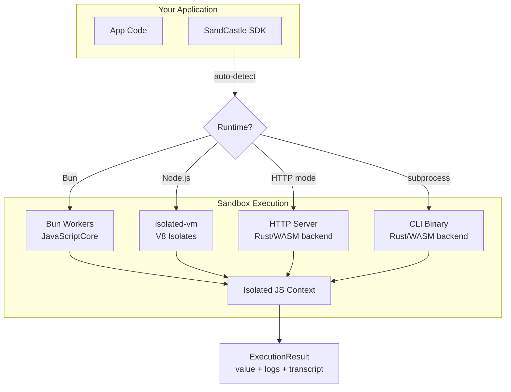

# SandCastle Architecture

## Overview



## Execution Backends

### Bun (default on Bun runtime)

Each call runs in a **Bun Worker thread** with its own JavaScriptCore context:

```
Main Thread                    Worker Thread
    │                              │
    ├─ postMessage(code, input) ──►│
    │                              ├─ new Function(code)
    │                              ├─ execute
    │                              ├─ capture console
    │◄─ postMessage(result) ───────┤
    │                              │
```

- **Zero dependencies** — uses Bun's built-in Worker API
- **Pooling** — warm workers reuse across calls (66K ops/sec)
- **Isolation** — separate JSC context per worker, no shared globals

### Node.js (default on Node runtime)

Uses [isolated-vm](https://github.com/nickelpackers/isolated-vm) for in-process V8 isolates:

```
Same Process, Same Thread
    │
    ├─ Isolate (reused from pool)
    │   └─ Context (reused)
    │       ├─ inject globals via ExternalCopy
    │       ├─ evalSync(wrappedCode)
    │       └─ extract result
    │
    └─ 281K ops/sec with context + evalSync optimization
```

- **Fastest path** — no thread boundary, no IPC
- **Context reuse** — 10x speedup over new-context-per-call
- **evalSync** — 3.7x speedup over async eval

### HTTP / Subprocess (optional)

Legacy backends for the Rust/WASM runtime:

- **HTTP mode** — talks to `sandcastle serve` (Rust server with Wasmtime + QuickJS)
- **Subprocess mode** — spawns `sandcastle` CLI binary per call

These are useful for multi-language backends or when you need the WASM isolation boundary.

## SDK Architecture

```
@grayhaven/sandcastle
├── src/
│   ├── client.ts          # SandCastle class, wrap(), session(), batch()
│   ├── singleton.ts       # Zero-config run(), evaluate() functions
│   ├── middleware.ts       # beforeExecute/afterExecute hooks
│   ├── core/
│   │   ├── bun-worker.ts  # Bun Worker executor + pool
│   │   ├── v8.ts          # isolated-vm executor + pool
│   │   ├── http.ts        # HTTP client for server mode
│   │   ├── subprocess.ts  # CLI spawn for subprocess mode
│   │   ├── errors.ts      # Typed error hierarchy
│   │   └── diagnostics.ts # Installation checking
│   ├── types/
│   │   ├── config.ts      # SandCastleOptions
│   │   ├── execution.ts   # ExecutionResult, ExecutionLimits
│   │   └── namespace.ts   # Multi-tenant dispatch types
│   └── codemode/          # Code Mode for AI agents
│       ├── create-code-tool.ts
│       ├── executor.ts    # TwoPassExecutor
│       ├── normalize.ts   # LLM output cleanup
│       └── types-gen.ts   # TypeScript declaration generation
```

## Security Model

| Layer | Bun Workers | V8 Isolates (Node.js) |
|-------|-------------|----------------------|
| Memory isolation | Separate Worker heap | Separate V8 Isolate heap |
| Global scope | No shared globals | No shared globals |
| Timeout | `worker.terminate()` | `evalSync` timeout param |
| Memory limit | Worker thread limits | `memoryLimit` option |
| Host access | Only via `postMessage` | Only via `Callback` / `ExternalCopy` |
| Network | None (unless host function) | None (unless host function) |
| Filesystem | None | None |
