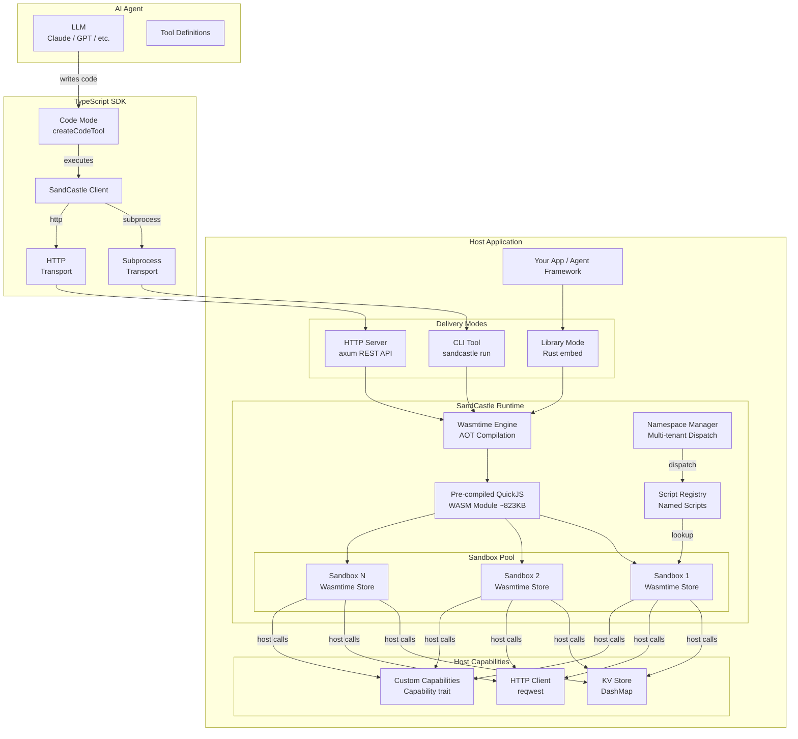
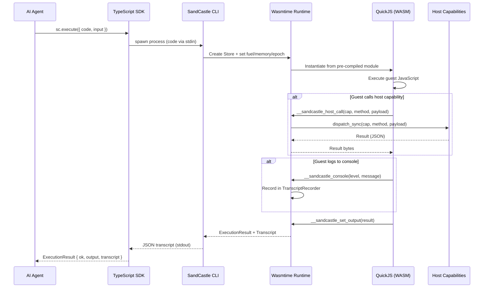
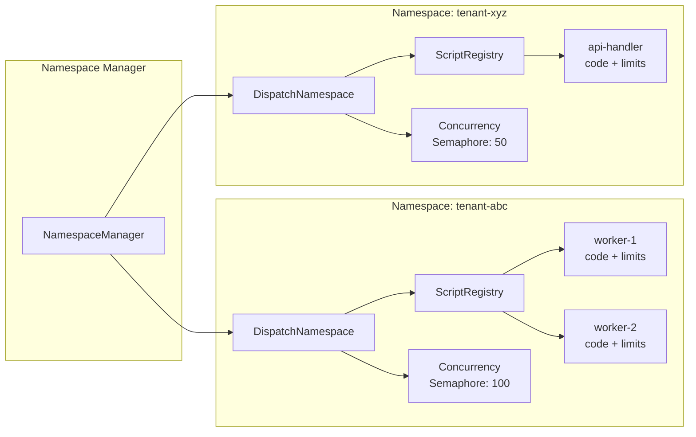
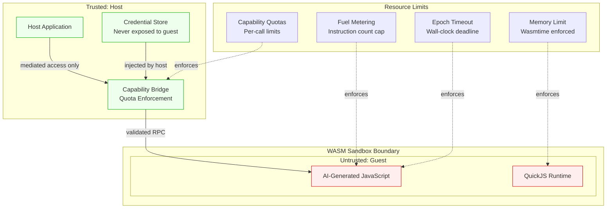

# SandCastle Architecture

## High-Level Overview



## Sandbox Execution Flow



## Code Mode Flow (Two-Pass)

```mermaid
sequenceDiagram
    participant LLM as Claude / LLM
    participant CM as Code Mode
    participant SB as SandCastle Sandbox
    participant HOST as Host Tools

    LLM->>CM: codemode tool_use { code: "async () => {<br/>  const user = await codemode.getUser({id: 42});<br/>  return user.name;<br/>}" }

    Note over CM: Pass 1: Collect tool calls
    CM->>SB: Execute with collector proxy
    SB-->>CM: { __codemode_calls: [{ tool: "getUser", args: {id: 42} }] }

    Note over CM: Pass 2: Execute tools host-side
    CM->>HOST: getUser({ id: 42 })
    HOST-->>CM: { id: 42, name: "Alice", email: "alice@example.com" }

    Note over CM: Pass 3: Replay with real results
    CM->>SB: Execute with pre-populated results
    SB-->>CM: "Alice"

    CM-->>LLM: tool_result: "Alice"
```

## Multi-Tenant Dispatch



## Security Boundary


